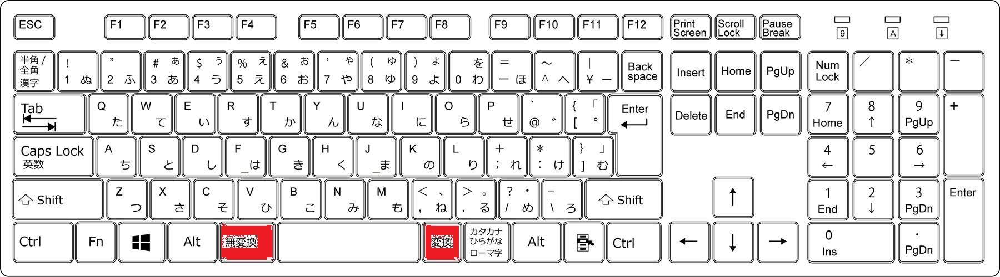

# はじめに

はじめまして。企業知財部で弁理士をしている【が】(@HaveFunMakeFuss)と申します。
主にツイッターで駄文を製造しています。
今回、ご縁あって知財アドベントカレンダー12月9日を担当させていただくことになりました。
がしかし、知財業務に直結するようなネタに関しては、他のそうそうたるメンバーを前に、恐れ多くとても語ることはできません。
そこで、私の知財歴（10年以上で）**最も業務効率の改善に寄与してくれたフリーソフト**について紹介したいと思います。


# 言いたいことを一言でいうと…
**フリーソフト[「Keyhac」](https://sites.google.com/site/craftware/keyhac-ja)は最強です。**
使い方次第で生産性が爆上がりします。
また、このソフトの使用が難しすぎる場合には、[enthumble](https://www.vector.co.jp/magazine/softnews/150303/n1503031.html)というソフトがおすすめです。

さらに、上記内容がマニアック過ぎるかもしれないので、もう少し万人受けしそうな[Multi Search & Multi Jump](https://chrome.google.com/webstore/detail/multi-search-multi-jump/oahidkobkdbfbknbloljgpjbeaefgapa?hl=ja)についても紹介します。


# 知財屋が最も使うPCソフトとデバイスとは？

普通のビジネスマンであれば、ソフトならエクセル、デバイスならマウスの使用頻度が高くなると思います。
もちろん知財屋もそうです。しかしながら、特に特許系の知財屋は文章を書いてナンボの職業なので、キーボードによる文章作成がメインの方が多いと思います。
かくいう私がそうです。PC作業の際は**そのほとんどの時間において、両手はキーボードの上にホームポジション状態でスタンバイされており、マウスに手を伸ばすのが凄く煩わしく感じます。**

そういう知財屋の中には、いわゆる「赤へそ」のついた[ThinkPadキーボード](https://www.lenovo.com/jp/ja/landingpage/accessories/thinkaccessories/thinkpad/02/)
を使っている人も多いかと思います。かくいう私がこのキーボードの愛用者です。

# ThinkPadキーボードでも解決できない問題

ThinkPadキーボードは非常に優秀なのですがやはり弱点があります。**ホームポジションを解除しないと「カーソルキー」を触れないのです。**

MS-Wordで文章を作成している場合、カーソルを上下左右に移動したいシチュエーションは数多く存在し、その度に両手のホームポジションを解除するのは非効率極まりないという問題がありました。


# Keyhacを使ってホームポジションのままカーソル移動

そこで、私が10年くらい愛用しているのが  [「Keyhac」](https://sites.google.com/site/craftware/keyhac-ja) というソフトです。
このソフトは、**かなり自由な**キーボードの入力設定のカスタマイズをユーザに提供してくれます。

その一つに**ユーザ任意のモディファイアキーの設定**というものがあります。
標準では、Alt, Ctrl, Shift, Win の 4 つのモディファイアが存在していますが、 これらとは別に、ユーザモディファイアを最大4つまで定義することが出来ます。

で、この**ユーザ任意のモディファイアキーの設定**を使って何をするか？

コイツらを活用するんですよ。



殆どの人が使用することのない**変換キー・無変換キー**を新たにユーザモディファイアキーにして、以下のような設定をするんです。

| キーバインド | 操作内容 |
|:-----------|:------------|
|【変換キー】＋【N】| 【カーソル↓】|
|【変換キー】＋【P】| 【カーソル↑】|
|【変換キー】＋【B】| 【カーソル←】|
|【変換キー】＋【F】| 【カーソル→】|
|【無変換キー】＋【N】| 【PageDown】|
|【無変換キー】＋【P】| 【PageUp】|
|【無変換キー】＋【B】| 【Home】|
|【無変換キー】＋【F】| 【End】|

なぜ「N」「P」｛B」「F」か？理屈を言うと「N（Next）」「P（Previous）」「B（Before）」「F（Fowward）」です。がしかし、Linux使いなら既にご認識かと思いますが、これ、**Emacs**というエディタのキーバインドを模倣しています。

また、Linuxの**Vi系のカーソル移動で用いられる「J(↓)」「K(↑)」「H(←)」「L(→)」**というものあります。これを**選択しながらの(シフトキーを押したままの)カーソル移動**にキーアサインしてやr8マス。

| キーバインド | 操作内容 |
|:-----------|:------------|
|【変換キー】＋【J】|シフトキーを押したままの【カーソル↓】(選択したまま↓キー)|
|【変換キー】＋【K】|シフトキーを押したままの【カーソル↑】(選択したまま↑キー)|
|【変換キー】＋【H】|シフトキーを押したままの【カーソル←】(選択したまま←キー)|
|【変換キー】＋【L】|シフトキーを押したままの【カーソル→】(選択したまま→キー)|
|【無変換キー】＋【J】|シフトキーを押したままの【PageDown】(選択したまま【PageDown】)|
|【無変換キー】＋【K】|シフトキーを押したままの【PageUp】(選択したまま【PageUp】)|
|【無変換キー】＋【H】|シフトキーを押したままの【Home】(選択したまま【PageUp】)|
|【無変換キー】＋【L】|シフトキーを押したままの【End】(選択したまま【PageUp】)|


上記のキーバインド（キーアサイン）を実現するためには、keyhacのconfig.pyに以下の記載をする必要があります。

```config.py

def configure(keymap):

    # 変換キー(28)を仮想キー235に置き換えた上で、
    #当該仮想キー235をモディファイアキーUser0に設定する
    keymap.replaceKey( "(28)", 235 )
    keymap.defineModifier( 235, "User0" )

    # 無変換キー(29)を仮想キー236に置き換えた上で、
    #当該仮想キー236をモディファイアキーUser1に設定する
    keymap.replaceKey( "(29)", 236 )
    keymap.defineModifier( 236, "User1" )


    # どのウインドウにフォーカスがあっても効くキーマップ
    if 1:
        keymap_global = keymap.defineWindowKeymap()

        # 上下左右の移動
        keymap_global[ "U0-B" ] = "Left"
        keymap_global[ "U0-N" ] = "Down"
        keymap_global[ "U0-P" ] = "Up"
        keymap_global[ "U0-F" ] = "Right"
        #PageUp PageDown Home Down
        keymap_global[ "U1-B" ] = "Home"
        keymap_global[ "U1-N" ] = "PageDown"
        keymap_global[ "U1-P" ] = "PageUp"
        keymap_global[ "U1-F" ] = "End"        

        # 上下左右(選択)の移動
        keymap_global[ "U0-H" ] = "S-Left"
        keymap_global[ "U0-J" ] = "S-Down"
        keymap_global[ "U0-K" ] = "S-Up"
        keymap_global[ "U0-L" ] = "S-Right"
        #PageUp PageDown Home Down (with 選択)
        keymap_global[ "U1-H" ] = "S-Home"
        keymap_global[ "U1-J" ] = "S-Pagedown"
        keymap_global[ "U1-K" ] = "S-Pageup"
        keymap_global[ "U1-L" ] = "S-End"
```

慣れるまでもいかしたら数週間かかるかもしれません。がしかし、一旦慣れると**絶対に元には戻れません**。キーボード操作だけでPC操作のすべてが完結すること、これを知らないと人生マジでそんでっせ。（なぜに上から目線）


# 上で言っていることがマニアックだと思っている人へ。[enthumble](https://www.vector.co.jp/magazine/softnews/150303/n1503031.html)の紹介

個人的には、激推しの操作方法ですが、特にキーバインド設定にPythonスクリプトを使うところがマニアックすぎると感じる方も多いかと思います。

この場合、[enthumble](https://www.vector.co.jp/magazine/softnews/150303/n1503031.html)というソフトがお奨めです。
私は使ったことはありませんが、上記のような設定が簡単にできるそうです。

# それでもマニアックと思っておられる方へ(GoogleExtention[Multi Search & Multi Jump](https://chrome.google.com/webstore/detail/multi-search-multi-jump/oahidkobkdbfbknbloljgpjbeaefgapa?hl=ja)について)

ここまで勢いで書き、冷静に見返すと**マニアックこの上ない話題**になってしまいました。
なので、もう少し、**知財業務を少し幸せにするTips**をさらに一点紹介します。
