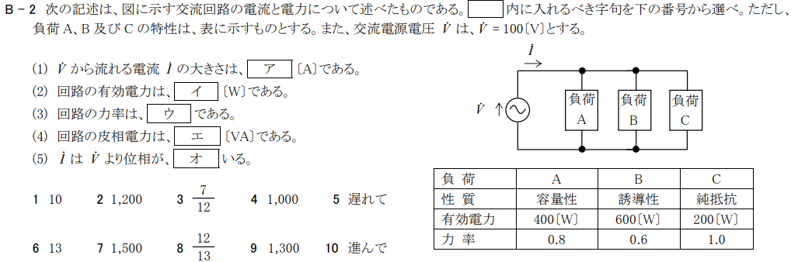

# 今北産業
一陸技の試験科目「無線工学の基礎」には**力率**の問題が頻出し、2020年11月の試験B-2でも出題された。

がしかし、この力率の問題について、私自身が納得できる解説が無かったので、**世界一くどくて詳しい一陸義の力率の攻略法**を以下に残します。

# 問題文について

\section{容量性、誘導性、純抵抗とは}
与えられた表は以下の通りです。
\begin{table}[htb]
  \begin{tabular}{|l|l|l|l|} \hline
    負荷 & A & B & C \\ \hline
    性質 & 容量性 & 誘導性 & 純抵抗 \\ \hline
    有効電力 & 400[W] & 600[W] & 200[W] \\ \hline
    力率 & 0.8 & 0.6 & 1.0 \\ \hline
  \end{tabular}
\end{table}

ここで、性質に記載されている「容量性」「誘導性」「純抵抗」の意味を考えます。

インピーダンス$Z$は、かならず$P+jQ$と複素数の形をとりますが、具体的には
\[
P + jQ = R + j\left(\omega L - \frac{1}{\omega C} \right)
\]
という形になります。

「容量性」とは、$C$成分$\frac{1}{\omega C}$の存在感が$L$成分$\omega L$より強いときのことを指します。

すなわち$\alpha$と$\beta$がともに0より大きい実数とすると

\[
[容量性のインピーダンスの形] = \alpha - j\beta
\]
となります。

逆に、「誘導性」とは、$L$成分の存在感が$C$成分よりも強いときのことを指しますので

\[
[誘導性のインピーダンスの形] = \alpha + j\beta
\]
となります。

また、「純抵抗」とは$R$成分のみが存在し、虚数部分がないことを指します。

なお、ご注意いただきたいのは、上記$\alpha$と$\beta$は、単にそれぞれのインピーダンスの「形」を表しているだけということです。同じ値を示しているわけではありません。

ここまでの情報を表を用いて整理すると以下の通りです。

\begin{table}[htb]
  \begin{tabular}{|l|l|l|l|} \hline
    負荷 & A & B & C \\ \hline
    性質 & 容量性 & 誘導性 & 純抵抗 \\ \hline
    有効電力 & 400[W] & 600[W] & 200[W] \\ \hline
    力率 & 0.8 & 0.6 & 1.0 \\ \hline
    インピーダンス & $\alpha_A - j\beta_A$ & $\alpha_B + j\beta_B$ & $\alpha_C$ \\ 
     & (以下$\dot{Z_A}$と表現する) & (以下$\dot{Z_B}$と表現する) & (以下$\dot{Z_C}$と表現する) \\ \hline
  \end{tabular}
\end{table}

\section{$\dot{I}$、$\dot{I_A}$、$\dot{I_B}$、$\dot{I_C}$の形}

次に、負荷A、B、Cそれぞれに流れる$\dot{I_A}、\dot{I_B}、\dot{I_C}$について検討します。

負荷A、B、Cは並列つなぎなので

\[
\dot{I} = \dot{I_A}+\dot{I_B}+\dot{I_C}
\]
が成立します。

\begin{figure}[htbp]
\begin{center}
\includesvg[width=150mm]{fig.svg}
\end{center}
\end{figure}

また、負荷A、B、Cすべてに$\dot{V}$が印加されるので、

\begin{eqnarray}
\dot{V} = \dot{I_A}\dot{Z_A} & = & \dot{I_A}(\alpha_A - j\beta_A) \\
\dot{V} = \dot{I_B}\dot{Z_B} & = & \dot{I_B}(\alpha_B + j\beta_B) \\
\dot{V} = \dot{I_C}\dot{Z_C} & = & \dot{I_C}\alpha_C
\end{eqnarray}

が成り立ちます。

ここで思い出していただきたいのが、問題文より\underline{ $\dot{V}$が100という実数値であることです }。

たとえば、数式(1)の場合、$\alpha_A - j\beta_A$に$\dot{I_A}$を掛けて実数値100となるわけです。
このとき、$\dot{I_A}$はどういう値をとるかというと$-j\beta_A$成分を打ち消すために\underline{プラスの虚数部分}
を有することとなります。すなわち、
\[
\dot{I_A} = X_A + jY_A
\]
という形になります。

同様に、$\dot{I_B}$も、$+j\beta_B$成分を打ち消すために\underline{マイナスの虚数部分}
を有することとなり、
\[
\dot{I_B} = X_B - jY_B
\]
という形になります。

なお、 $\dot{I_C}$については、$\dot{Z_C}$が純抵抗で実数であるため
\[
\dot{I_C} = X_C
\]
という形になります。

ここまでを表にしてまとめると以下の通りです。

\begin{table}[htb]
  \begin{tabular}{|l|l|l|l|} \hline
    負荷 & A & B & C \\ \hline
    性質 & 容量性 & 誘導性 & 純抵抗 \\ \hline
    有効電力 & 400[W] & 600[W] & 200[W] \\ \hline
    力率 & 0.8 & 0.6 & 1.0 \\ \hline
    インピーダンス & $\dot{Z_A}=\alpha_A - j\beta_A$ & $\dot{Z_B}=\alpha_B + j\beta_B$ & $\dot{Z_C}=\alpha_C$ \\ \hline
    電流値 & $\dot{I_A}=X_A + jY_A$ & $\dot{I_B}=X_B - jY_B$ & $\dot{I_C}=X_C$ \\ \hline
  \end{tabular}
\end{table}

\section{$\dot{I}、\dot{I_A}、\dot{I_B}、\dot{I_C}$の具体的な値}

次に「力率」に着目して$\dot{I}、\dot{I_A}、\dot{I_B}、\dot{I_C}$の具体的な値を求めます。

負荷Aの場合、力率は0.8です。つまり電流値を$I_A = |I_A|( \cos \theta + j \sin \theta )$の形式で表現すると

\begin{eqnarray}
\dot{I_A} & = & X_A + jY_A \nonumber \\
          & = & |I_A| \left( 0.8 + j 0.6 \right)
\end{eqnarray}

となります。$\cos \theta$が0.8である場合には、$\sin \theta$の大きさは0.6となるからです。
（直角三角形の3:4:5の関係を思い出してください。）

同様に、$\dot{I_B}$について検討すると、負荷Bの力率は0.6なので
\begin{eqnarray}
\dot{I_B} & = & X_B - jY_B \nonumber \\
          & = & |I_B| \left( 0.6 - j 0.8 \right)
\end{eqnarray}
となります。

また純抵抗である負荷Cはについては$|I_C|=X_C$です。

次に、$|I_A|$、$|I_B|$、$|I_C|$それぞれの値を有効電力を用いて求めます。すなわち
\[
[有効電力]= |I||V| \cos \theta
\]
なので、$|I_A|$については、
\begin{eqnarray}
P_A  & = & 400 \nonumber \\
     & = & |I_A||V| \cos \theta \nonumber \\
     & = &  |I_A| \cdot 100 \cdot 0.8 \nonumber 
\end{eqnarray}
より、
\begin{eqnarray}
|I_A|  & = & 5 \nonumber
\end{eqnarray}
になります。

よって、$\dot{I_A}$についてまとめると、
\begin{eqnarray}
\dot{I_A} & = & 5(0.8 + j0.6) \nonumber \\
          & = & 4+j3
\end{eqnarray}
となります。

同様に、$|I_B|$については、
\begin{eqnarray}
P_B  & = & 600 \nonumber \\
     & = & |I_B||V| \cos \theta \nonumber \\
     & = &  |I_B| \cdot 100 \cdot 0.6 \nonumber 
\end{eqnarray}
より、
\begin{eqnarray}
|I_B|  & = & 10 \nonumber
\end{eqnarray}
になります。

よって、$\dot{I_B}$についてまとめると、
\begin{eqnarray}
\dot{I_B} & = & 10(0.6 - j0.8) \nonumber \\
          & = & 6-j8
\end{eqnarray}
となります。

そして、$|I_C|$については、
\begin{eqnarray}
P_C  & = & 200 \nonumber \\
     & = & |I_C||V| \cos \theta \nonumber \\
     & = &  |I_C| \cdot 100 \cdot 1.0 \nonumber 
\end{eqnarray}
より、
\begin{eqnarray}
|I_C|  & = & 2 \nonumber
\end{eqnarray}
になります。

よって、$\dot{I_C}$についてまとめると、
\begin{eqnarray}
\dot{I_C} & = & 2
\end{eqnarray}
となります。

ここで、再び表にしてまとめると上の通りです。

\begin{table}[htb]
  \begin{tabular}{|l|l|l|l|} \hline
    負荷 & A & B & C \\ \hline
    性質 & 容量性 & 誘導性 & 純抵抗 \\ \hline
    有効電力 & 400[W] & 600[W] & 200[W] \\ \hline
    力率 & 0.8 & 0.6 & 1.0 \\ \hline
    インピーダンス & $\dot{Z_A}=\alpha_A - j\beta_A$ & $\dot{Z_B}=\alpha_B + j\beta_B$ & $\dot{Z_C}=\alpha_C$ \\ \hline
    電流値 & $\dot{I_A}=X_A + jY_A$ & $\dot{I_B}=X_B - jY_B$ & $\dot{I_C}=X_C$ \\ \hline
    具体的電流値 & $\dot{I_A}=5(0.8+j0.6)$ & $\dot{I_B}=10(0.6-j0.8)$ & $\dot{I_C}=2$ \\
                 & $\dot{I_A}=4+j3$ & $\dot{I_B}=6-j8$ &  \\ \hline
  \end{tabular}
\end{table}

そして、冒頭にも説明した通り

\[
\dot{I} = \dot{I_A}+\dot{I_B}+\dot{I_C}
\]
であるため、$\dot{I}$は、

\begin{eqnarray}
\dot{I} & = & \dot{I_A}+\dot{I_B}+\dot{I_C} \nonumber \\
        & = & (4+j3) + (6- j8) + 2 \nonumber \\
        & = & 12-j5 \nonumber \\
        & = & 13 \left( \frac{12}{13}  - j \frac{5}{13}\right)
\end{eqnarray}

となります。(5:12:13という辺比を持つ直角三角形があることを思い出してください)

これで、事前準備は終了です。

\section{問題文について}

\subsection{(1)について}
上記数式(9)より
\begin{eqnarray}
\dot{I} & = &  13 \left( \frac{12}{13}  - j \frac{5}{13}\right) \nonumber
\end{eqnarray}
なので、答えは「13」です。

\subsection{(2)について}
負荷A、B、Cそれぞれでの有効電力を足すだけです。

よって、答えは「1200」です。

\subsection{(3)について}

上記数式(9)より
\begin{eqnarray}
\dot{I} & = &  13 \left( \frac{12}{13}  - j \frac{5}{13}\right) \nonumber     
\end{eqnarray}
なので、答えは「$\frac{12}{13}$」です。

\subsection{(4)について}

式(9)より$|I|=13$なので
\begin{eqnarray}
P & = &   |I|\cdot |V| \nonumber \\        
  & = &   13 \cdot 100　\nonumber
\end{eqnarray}
となり、答えは「1300」となります。

\subsection{(5)について}

上記数式(9)より、$\dot{I}$は
\begin{eqnarray}
\dot{I} & = &  12-j5 \nonumber
\end{eqnarray}
と、\underline{マイナスの虚数成分を有しています}。

一方、$\dot{V}$は100と実数値です。

よって、$\dot{I}$の位相は、$\dot{V}$よりも「遅れて」います。

\begin{flushright}
以上
